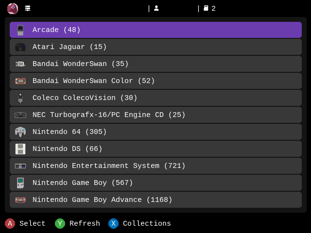
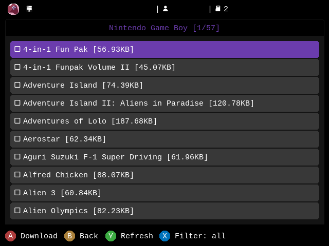

<!-- trunk-ignore-all(markdownlint/MD033) -->
<!-- trunk-ignore(markdownlint/MD041) -->

  
    <h3 style="font-size: 25px;">
    A beautiful, powerful, RomM app for muOS.
  </h3>

 

[![license-badge-img]][license-badge]

<!-- [![wiki-badge-img]][wiki] -->

  

# Overview

An app for CFWs that connects to your RomM instance and allows you to fetch games wirelessly from your handheld device.

## Screenshots

  
  

## Installation

We use PortMaster to run the app on our device.

1. Download this Repo
2. Make a copy of `RomM/env.template`, rename it to `RomM/.env`, edit it and set HOST, USERNAME and PASSWORD.
3. Copy all files to the `Roms/PORTS64` folder on your SD Card.
4. Launch From `GAME -> PORTS`

## Support

> [!NOTE]
> Your device must connect to your RomM instance or home server over Wi-Fi. The easiest method is to keep them on the same network and set HOST to the server's IP and the port where RomM is running. Advanced users or those using reverse proxies can configure their network and DNS settings as needed, using a URL with a domain like `https://romm.domain.com`.

If you have any issues with the app, please [open an issue](https://github.com/Dark98/RomM-Spruce/issues/new) in this repository. If the issue is with RomM itself, open an issue in the [RomM repository](https://github.com/rommapp/romm/issues/new/choose).

<!-- Badges -->

[license-badge-img]: https://img.shields.io/github/license/rommapp/muos-app?style=for-the-badge&color=a32d2a
[license-badge]: LICENSE
